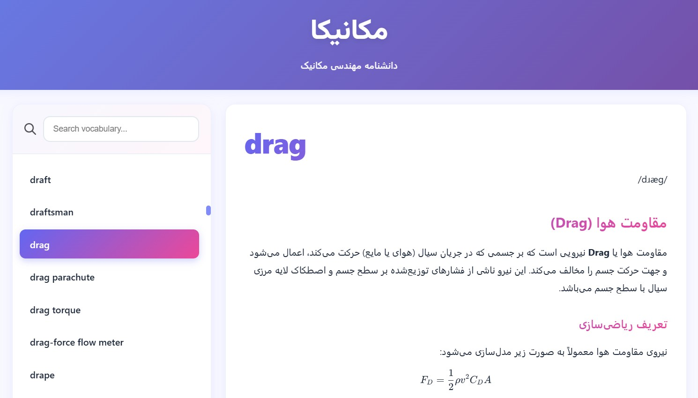
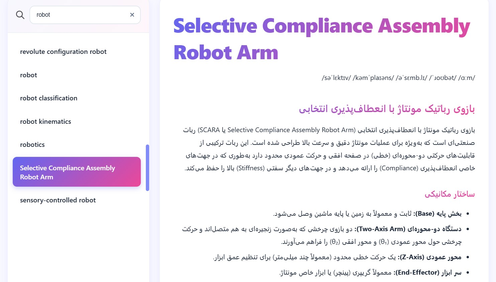
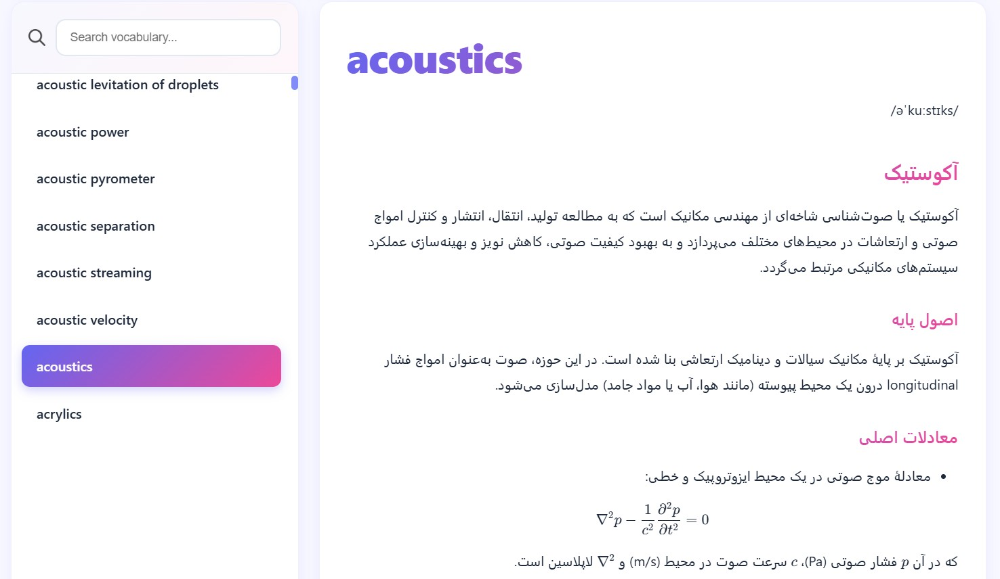

# 📚 مکانیکا - دانشنامه مهندسی مکانیک

یک دانشنامه آفلاین و مدرن برای اصطلاحات مهندسی مکانیک با رابط کاربری فارسی و امکانات پیشرفته.


## 📸 تصاویر

<div align="center">

### صفحه اصلی و لیست کلمات


### نمایش جزئیات و تعاریف


### رندر فرمول‌های ریاضی


</div>

## ✨ ویژگی‌ها

- 🔍 **جستجوی سریع و هوشمند** - جستجوی لحظه‌ای در میان هزاران اصطلاح
- 🎨 **رابط کاربری مدرن** - طراحی زیبا با گرادیانت‌های رنگی و انیمیشن‌های روان
- 🔊 **تلفظ صوتی** - پخش تلفظ صحیح کلمات انگلیسی
- 📖 **پشتیبانی از Markdown** - نمایش تعاریف با فرمت‌بندی کامل
- 🧮 **فرمول‌های ریاضی** - رندر فرمول‌های LaTeX با KaTeX
- 🌐 **لینک به منابع خارجی** - دسترسی سریع به Wikipedia و Google
- 📱 **طراحی ریسپانسیو** - سازگار با موبایل، تبلت و دسکتاپ
- ⚡ **عملکرد بالا** - استفاده از SQLite و better-sqlite3 برای سرعت بالا
- 🌙 **RTL کامل** - پشتیبانی کامل از راست‌چین فارسی

## 🚀 نصب و راه‌اندازی

### پیش‌نیازها

- [Node.js](https://nodejs.org/en/download) نسخه 14 یا بالاتر
- npm یا yarn
### 1- [دانلود](https://github.com/payam-shg/Mechanica/releases)

### 2- ساخت محلی

1. کلون کردن مخزن:
```bash
git clone https://github.com/[username]/mech-dict.git
cd mech-dict
```

2. نصب وابستگی‌ها:
```bash
npm install
```

3. اطمینان از وجود فایل دیتابیس:
   - فایل `database.db` باید در ریشه پروژه وجود داشته باشد
   - ساختار جدول باید شامل ستون‌های: کلمه، معنی، لینک صوتی، و لینک ویکی‌پدیا باشد

4. اجرای سرور:
```bash
npm start
```

5. باز کردن مرورگر:
```
http://localhost:3000
```

## 📁 ساختار پروژه

```
mech-dict/
├── public/              # فایل‌های فرانت‌اند
│   ├── index.html      # صفحه اصلی
│   ├── app.js          # لاجیک کلاینت
│   └── styles.css      # استایل‌ها
├── server.js           # سرور Express
├── database.db         # دیتابیس SQLite
├── ic1.ico - ic4.ico   # آیکون‌های رابط کاربری
├── package.json        # تنظیمات پروژه
└── README.md           # مستندات
```

## 🛠️ تکنولوژی‌های استفاده شده

### Backend
- **Node.js** - محیط اجرای JavaScript
- **Express 5** - فریمورک وب
- **better-sqlite3** - درایور SQLite با کارایی بالا
- **CORS** - مدیریت Cross-Origin Resource Sharing

### Frontend
- **Vanilla JavaScript** - بدون فریمورک اضافی
- **Marked.js** - پردازش Markdown
- **KaTeX** - رندر فرمول‌های ریاضی
- **Vazirmatn Font** - فونت فارسی زیبا

## 📊 ساختار دیتابیس

دیتابیس SQLite باید حداقل شامل یک جدول با ستون‌های زیر باشد:

| ستون | نوع | توضیحات |
|------|-----|---------|
| word | TEXT | کلمه انگلیسی |
| meaning | TEXT | معنی و توضیحات (با پشتیبانی Markdown) |
| audio_url | TEXT | لینک فایل صوتی تلفظ |
| wiki_url | TEXT | لینک صفحه ویکی‌پدیا (اختیاری) |

## 🎯 API Endpoints

### دریافت لیست کلمات
```http
GET /api/words?search=query
```

### دریافت جزئیات یک کلمه
```http
GET /api/words/:word
```

### بررسی سلامت سرور
```http
GET /api/health
```

## ⚙️ متغیرهای محیطی

می‌توانید تنظیمات را با متغیرهای محیطی سفارشی کنید:

```bash
PORT=3000                    # پورت سرور
DB_PATH=./database.db        # مسیر فایل دیتابیس
DB_TABLE=words               # نام جدول
DB_WORD_COL=word            # نام ستون کلمه
DB_MEANING_COL=meaning      # نام ستون معنی
DB_AUDIO_COL=audio_url      # نام ستون صوت
DB_WIKI_COL=wiki_url        # نام ستون ویکی
```

## 🎨 سفارشی‌سازی

### تغییر رنگ‌ها
رنگ‌های اصلی در فایل `public/styles.css` در بخش `:root` قابل تغییر هستند:

```css
:root {
  --primary: #6366f1;
  --accent: #ec4899;
  --bg: linear-gradient(135deg, #667eea 0%, #764ba2 100%);
}
```

### افزودن آیکون‌های جدید
آیکون‌های جدید را در ریشه پروژه قرار دهید و نام آن‌ها را به لیست `ICONS` در `server.js` اضافه کنید.

## 📝 نحوه استفاده

1. **جستجو**: در کادر جستجو تایپ کنید تا فیلتر شود
2. **انتخاب کلمه**: روی هر کلمه کلیک کنید تا جزئیات نمایش داده شود
3. **تلفظ**: دکمه Pronounce را برای شنیدن تلفظ کلیک کنید
4. **منابع بیشتر**: از دکمه‌های Wikipedia و Google برای اطلاعات بیشتر استفاده کنید

## 📦 وابستگی‌ها

### وابستگی‌های اصلی (Production)
برای اجرای برنامه فقط به این ماژول‌ها نیاز دارید:
- **express** `^5.1.0` - فریمورک وب
- **cors** `^2.8.5` - مدیریت CORS
- **better-sqlite3** `^12.2.0` - درایور SQLite

### وابستگی‌های اضافی (Development)
ماژول‌های زیر در `package.json` موجود هستند ولی برای اجرای برنامه ضروری نیستند (احتمالاً برای ساخت دیتابیس از CSV استفاده می‌شوند):
- `csv-parse`, `csv-parser`, `csv-stringify`, `iconv-lite`

## محدودیت ها و خطاها
1. محدودیت ای پی آی تغییر مسیر (Redirect) ویکیپدیا.
2. محدودیت ای پی آی دریافت لینک تلفظ لغات.
3. محدودیت ای پی آی دریافت لینک فونتیک لغات.
4. خطای ای پی آی هنگام دریافت تلفظ و فونتیک اختصارات.

سعی بر آن است که این خطاها در ورژن های آینده برطرف گردند.
## 🐛 گزارش باگ

برای گزارش باگ یا درخواست ویژگی جدید، لطفاً یک Issue در GitHub باز کنید.

## 📄 لایسنس

این پروژه تحت لایسنس ISC منتشر شده است.

## 👨‍💻 سازنده

**پیام شفیعی**

ساخته شده با ❤️ برای یادگیری بهتر

## 🙏 تشکر

- [Express.js](https://expressjs.com/)
- [better-sqlite3](https://github.com/WiseLibs/better-sqlite3)
- [Marked.js](https://marked.js.org/)
- [KaTeX](https://katex.org/)
- [Vazirmatn Font](https://github.com/rastikerdar/vazirmatn)

---

⭐ اگر این پروژه برایتان مفید بود، یک ستاره بدهید!


